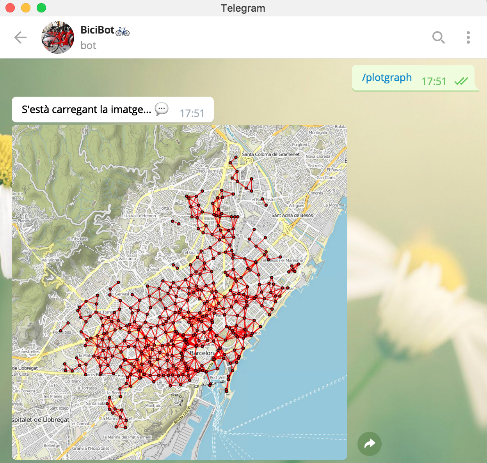
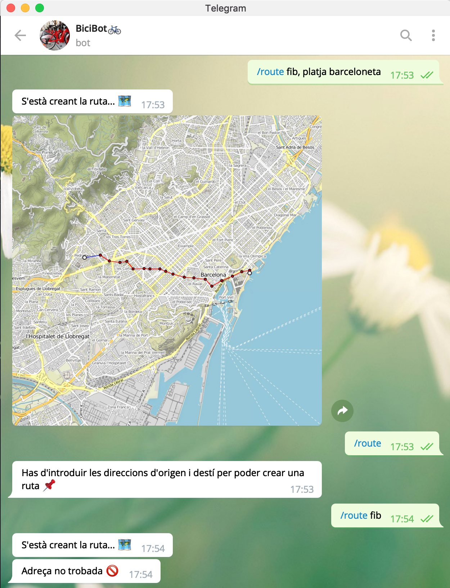
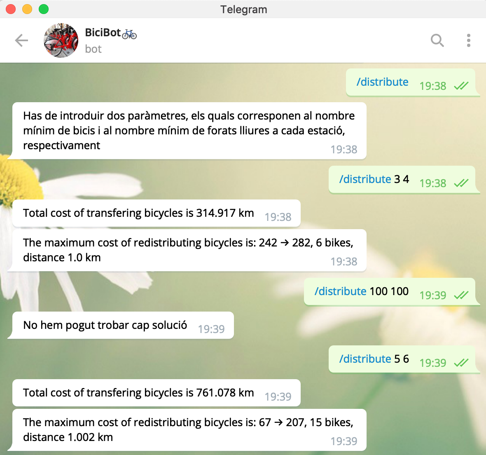

# BicingBot

Implementació d'un Bot de Telegram, anomenat BiciBot🚲, que contesta textualment i gràficament, amb imatges png del mapa de Barcelona, preguntes relacionades amb grafs geomètrics definits sobre les estacions del Bicing de Barcelona.

### Què és Bicing?

El Bicing és el transport urbà basat en l’ús compartit de la bicicleta mecànica i elèctrica. Un servei senzill, pràctic i sostenible que pots utilitzar en els teus trajectes per la ciutat. Per anar on vulguis i quan vulguis, sense fums ni sorolls.

Més informació a [bicing](https://www.bicing.barcelona/).

### Què és un bot de Telegram?

Bot és una aplicació que s'executa a Telegram. Els usuaris poden iteractuar amb els bots enviant-los missatges o comandes. Pots crear el teu propi bot i controlar-lo mitjançant un API token.

Més informació a [Telegram Bots](https://core.telegram.org/bots)

### BiciBot🚲

El nom oficial del bot és BiciBot🚲 i es pot trobar amb el nom d'usuari @bicibot_bot.

### En què ens beneficia aquest bot?

Aquest bot és una ampliació del servei Bicing de Barcelona. En ell podem trobar diferents aplicacions, com per exemple un mapa de les estacions de Bicing disponibles o la ruta disponible més ràpida per anar d'un punt a un altre. Més endevant, l'apartat de comandes fem una descripció més detallada dels usos del bot.

# Índex

- [Requeriments](# Requeriments)
- [Graf geomètric](# Graf geomètric)
- [Dades](# Dades)
- [Utilitat](# Utilitat)
  - [Recull de comandes](## Recull de comandes)
  - [Gestió d'errors](## Gestió d'errors)
    - [El diccionari user_data](### El diccionari user_data)
  - [Jocs de prova](## Jocs de prova)
- [Informació adicional](# Informació adicional)
- [Autores](# Autores)

# Requeriments

*Requirements.txt* és un fitxer de text que conté tots els mòduls necessaris per executar el bot correctament, en la versió en què han estat utilitzats.

Per instal·lar els mòduls cal executar la comanda següent
```
pip3 install -r requirements.txt
```

# Graf geomètric

Per elaborar el bot, hem implementat un graf geomètric.

Un conjunt de punts en un espai i una distància *d* defineixen un graf geomètric que té com a vèrtexs els punts i, com arestes, aquells parells de punts que es troben a distància `<= d`.

Per crear aquest graf, hem utilitzat el mòdul NetworkX, el qual ofereix una classe Graf i una àmplia oferta de funcions que es poden utilitzar en ella. Per més informació, consultar la pàgina web de [NetworkX](https://networkx.github.io/documentation/stable/reference/introduction.html).

# Dades

Les dades amb les estacions de Bicing de la ciutat de Barcelona (mecàniques i elèctriques) es poden trobar als següents enllaços.

[station_information](https://api.bsmsa.eu/ext/api/bsm/gbfs/v2/en/station_information)

Aquest és un arxiu en format JSON que inclou diverses informacions sobre les estacions de bicing (coordenades geogràfiques, adreça, etc.).

[station_status](https://api.bsmsa.eu/ext/api/bsm/gbfs/v2/en/station_status)

Aquest és un arxiu en format JSON que inclou diverses informacions sobre l'estat actual de les estacions de bicing (nombre de bicicletes, nombre de forats lliures, etc.).

Ambdós arxius s'actualitzen dinàmicament.

# Utilitat

Aquest bot recull una àmplia col·lecció de comandes disponibles als usuaris, per tal d'implementar el servei Bicing. També contempla mètodes per gestionar els possibles errors alhora d'utilitzar el graf.

## Recull de comandes

Aquí tenim una llista amb totes les comandes i la seva descripció:

- ```Start``` : inicialitza el bot i crea automàticament un graf de distància 1000.

- ```Help``` : fa una llista de les possibles comandes amb una breu descripció d'elles.

- ```Graph``` : crea un nou graf. Amb aquesta comanda has d'introduir un paràmetre, el qual correspon a la distància màxima de les arestes que formen el graf.

- ```Nodes``` : escriu el nombre d'estacions del graf.

- ```Edges``` : escriu el nombre d'arestes del graf.

- ```Components``` : escriu el nombre de components connexos del graf.

- ```Plotgraph``` : mostra en una imatge png un mapa totes les estacions que conformen el graf i les arestes que les connecten.

- ```Route``` : mostra en una imatge png un mapa amb el camí més ràpid per anar d'una direcció d'origen a una direcció de destí. Amb aquesta comanda has d'introduir dues direccions de Barcelona.

- ```Authors``` : nom i email de les autores del bot.

- ```Distribute``` : fa una redistribució de les bicis de cada estació. Amb aquesta comanda has d'introduir dos paràmetres, els quals corresponen, respectivament, al nombre de bicis mínim i al nombre de forats mínim per cada estació.

## Gestió d'errors

El bot també gestiona diferents tipus d'errors que es poden produir per evitar problemes.

El primer error que es té en compte és la precissió de les distàncies degut a truncaments. Això passa quan adjudiquem una estació a una casella de la graella. Per tractar d'aminorar això hem introduït una Epsilon de 0,005.

La resta d'errors, estan causats principalment per equivocacions a l'hora d'interactuar amb el bot per part dels usuaris.

Per començar, si escrivim una comanda del bot malament a la conversa de Telegram, el propi bot ignora el missatge i no fa res.

En canvi, si la comanda està ben escrita però no es pot executar bé la crida per algun motiu, el bot està programat per respondre adientment a cada situació. Cadascuna de les situacions següents estan gestionades per evitar problemes.

- Si alguna de les comandes següents s'envia sense haver inicialitzat un graf anteriorment, no es pot executar.

  Llista de comandes que segueixen aquesta condició: ```nodes```, ```edges```, ```components```, ```plotgraph```, ```route``` i ```distribute```.

- Si la comanda requereix paràmetres i no s'han introduit o s'introdueix un nombre incorrecte.

- Si la comanda no necessita cap paràmetre i s'introdueix algun, s'ignora i s'executa la comanda sense ell.

- En la comanda ```graph```, si la distància introduïda és negativa.

- En la comanda ```route```, a part dels errors anteriors, també pot ser que les direccions introduides com a paràmetres no corresponguin amb direccions reals i que, per tant, no les poguem obtenir.

- En la comanda ```distribute```, trobem alguns errors particulars que són:
  - Si s'executa la funció de redistribució i no es troba cap solució.
  - Si el model de graf és incorrecte.

### El diccionari user_data

Per evitar problemes de col·lisió entre grafs de diferents usuaris, els bots de python ofereixen una solució, el qual és un diccionari anomenat *user_data*. En aquest es pot desar informació de la conversa i és diferent per a cada usuari.

## Jocs de prova

A continuació, tenim un recull d'imatges que mostren el funcionamet del bot,
amb les seves comandes i alguns errors:

Comandes:
-  ```authors```
- ```edges``` i ```plotgraph``` com a exemple de l'error de graf no inicialitzat
- ```start```

<center></center>

- ```help```  

<center></center>

- ```graph``` sense introduir distància
- ```graph```
- ```nodes```
- ```edges```
- ```components```

<center></center>

- ```plotgraph```

<center></center>

- ```route```
- ```route``` amb errors

<center></center>

- ```distribute``` sense paràmetres
- ```distribute``` sense solució
- ```distribute```

<center></center>

# Informació adicional

En l'elaboració del bot, hem fet servir els següents mètodes:

- A l'hora de crear el graf, hem creat una graella que representa la superfície
del mapa de Barcelona. Les caselles de la graella són de mida de la distància màxima de les arestes. Cada estació de Bicing té una latitud i una longitud que correspon a una casella. Per buscar les arestes, l'algorisme afegeix aquelles que estan a la mateixa casella de l'estació que estem mirant i les vuit del seu voltant, sempre i quan la distància entre les estacions dos a dos sigui igual o menor a la distància introduïda.

- Per calcular la ruta entre dues direccions, hem utilitzat la funció del mòdul NetworkX *dijkstra_path*. Aquesta funció fa servir l'algorisme de Dijkstra per calcular el camí de menys pes entre dos nodes. Per més informació sobre aquesta funció anar a la [pàgina web](https://networkx.github.io/documentation/stable/reference/algorithms/generated/networkx.algorithms.shortest_paths.weighted.dijkstra_path.html#networkx.algorithms.shortest_paths.weighted.dijkstra_path).

- La simulació de la redistribució de les bicis entre les estacions, l'hem implementat amb la funció del mòdul NetworkX *network_simplex*. Aquesta funció fa servir l'algorisme de mínim flow. Per veure més informació consultar la [pàgina web](https://networkx.github.io/documentation/stable/reference/algorithms/generated/networkx.algorithms.flow.network_simplex.html#networkx.algorithms.flow.network_simplex).

Per poder tenir el bot permanentment encès, l'hem d'instal·lat en un servidor connectat a un ordinador de la FIB.

# Autores

Les autores d'aquest bot són la Marina Rosell Murillo i la Patricia Cabot Álvarez.

Per contactar amb elles, envieu un e-mail a:

- marina.rosell@est.fib.upc.edu
- patricia.cabot@est.fib.upc.edu

Aquest projecte ha estat realitzat a la Universitat Politècnica de Catalunya.
